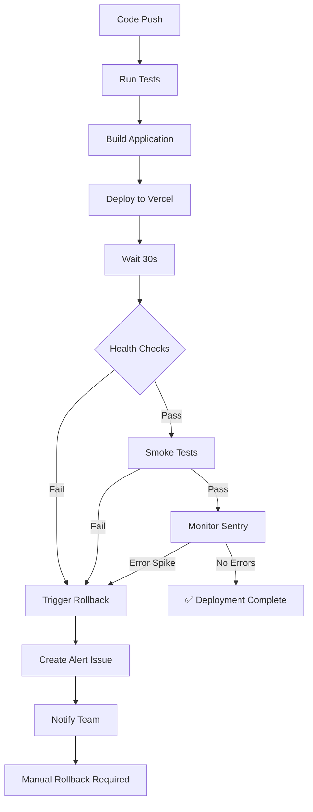

# Rollback Strategies & Deployment Safety

This document outlines the rollback mechanisms and deployment safety features configured in the CI/CD pipeline.

## Overview

The CI/CD pipeline includes multiple layers of protection to ensure production stability:

1. **Automated Health Checks** - Post-deployment validation
2. **Smoke Tests** - Critical endpoint verification
3. **Automated Rollback Triggers** - Failure detection and response
4. **Manual Rollback Workflow** - One-click rollback capability
5. **Continuous Monitoring** - 24/7 health monitoring

---

## Automated Rollback Flow

### Deployment Process with Safety Checks



### Health Check Pipeline

After each production deployment, the pipeline automatically:

1. **Waits 30 seconds** for deployment to stabilize
2. **Checks Homepage** - Verifies HTTP 200/301/302 response
3. **Tests Critical Endpoints**:
   - `/auth/login` - Authentication system
   - `/browse` - Property browsing
4. **Monitors Response Time** - Alerts if > 3 seconds
5. **Watches Sentry** - Checks for new errors (60s window)

### Automatic Failure Detection

The pipeline will **trigger rollback** if:

- ❌ Homepage returns HTTP error (4xx, 5xx)
- ❌ Critical endpoints fail (non-200 response)
- ❌ Response time exceeds 5 seconds
- ❌ Sentry reports error spike

---

## Manual Rollback

### Quick Rollback via GitHub Actions

**When to use:** Immediate rollback needed for critical issues

**Steps:**

1. Go to **Actions** tab in GitHub
2. Select **"Manual Rollback"** workflow
3. Click **"Run workflow"**
4. Fill in:
   - **Reason**: Brief description (e.g., "Critical auth bug")
   - **Deployment ID**: (Optional) Specific deployment to rollback to
5. Click **"Run workflow"**

The workflow will:
- Create tracking issue
- Notify team
- Provide rollback instructions
- Link to Vercel dashboard

### Rollback via Vercel Dashboard

**Best for:** Most rollback scenarios (instant, no downtime)

1. Go to [Vercel Deployments](https://vercel.com/deployments)
2. Find your project: **real-estate-app**
3. Click on current deployment
4. Click **"Rollback to this deployment"** on previous stable version
5. Confirm rollback

**Result:** Instant rollback (< 30 seconds), zero downtime

### Rollback via Git

**For:** Code-level rollback with full control

```bash
# 1. Identify the commit to rollback to
git log --oneline

# 2. Create revert commit
git revert <bad-commit-sha>

# Or reset to previous commit (use with caution)
git reset --hard <good-commit-sha>

# 3. Force push (only if necessary)
git push origin trunk --force

# 4. Or create new branch for safety
git checkout -b hotfix/rollback-issue
git push origin hotfix/rollback-issue

# 5. Create PR to merge fix
```

---

## Rollback Strategies by Scenario

### Scenario 1: Deployment Health Check Fails

**Automatic Response:**
- ✅ Health check job fails
- ✅ Rollback job triggers automatically
- ✅ Alert issue created
- ✅ Team notified

**Manual Action Required:**
1. Review health check logs
2. Complete rollback via Vercel dashboard
3. Investigate root cause
4. Fix and redeploy

---

### Scenario 2: Critical Bug in Production

**Steps:**

1. **Immediate Rollback** (Choose one):
   - **Option A**: Vercel Dashboard (fastest)
   - **Option B**: GitHub Actions → Manual Rollback
   
2. **Document Issue**:
   - Create GitHub issue with bug details
   - Link to Sentry error (if applicable)
   - Tag as `critical` and `rollback`

3. **Fix Bug**:
   - Create hotfix branch
   - Fix and test thoroughly
   - Deploy with full CI/CD validation

4. **Verify Fix**:
   - Monitor Sentry for 1 hour
   - Check health metrics
   - Close rollback issue

---

### Scenario 3: Performance Degradation

**Detection:**
- Continuous monitoring alerts (every 15 minutes)
- Sentry performance tracking
- User reports

**Response:**

1. **Assess Severity**:
   - Minor (<1s degradation): Investigate, schedule fix
   - Major (>3s degradation): Consider rollback

2. **If Rollback Needed**:
   ```bash
   # Via GitHub Actions
   Actions → Manual Rollback → Run
   Reason: "Performance degradation - response time >3s"
   ```

3. **Investigation**:
   - Check Vercel function logs
   - Review database queries
   - Analyze Sentry performance data
   - Check external API performance

---

### Scenario 4: Database Migration Issues

**Prevention:**
- ✅ Test migrations in preview deployments
- ✅ Use Supabase migrations system
- ✅ Always create rollback migration

**If Issue Occurs:**

1. **Don't rollback code immediately**
   - Database state may not match old code
   
2. **Assess Migration**:
   ```bash
   # Check migration status in Supabase
   # Create rollback migration if needed
   ```

3. **Options**:
   - **Option A**: Fix forward (deploy migration fix)
   - **Option B**: Rollback migration, then rollback code
   - **Option C**: Put site in maintenance mode, fix migration

---

## Continuous Monitoring

### Automated Health Monitoring

**Frequency:** Every 15 minutes (24/7)

**What's Monitored:**
- ✅ Homepage availability (HTTP status)
- ✅ API endpoint health
- ✅ Response time performance
- ✅ SSL certificate validity

**Alerts Triggered:**
- 🚨 **Production Down** - Immediate GitHub issue
- ⚠️ **Performance Degraded** - Warning issue
- ⚠️ **Error Spike** - Sentry integration

### Manual Monitoring

**Daily Checks** (5 minutes):
1. [Sentry Dashboard](https://sentry.io/organizations/makerere-university-h0/projects/javascript-nextjs/)
   - Check error count (should be low)
   - Review new issues
   
2. [Vercel Deployments](https://vercel.com/deployments)
   - Verify latest deployment is healthy
   - Check build times
   
3. [Production Site](https://real-estate-hub-eight.vercel.app)
   - Spot-check critical features
   - Test authentication

---

## Rollback Checklist

### Before Rollback

- [ ] Confirm the issue is critical and requires rollback
- [ ] Document the issue (create GitHub issue)
- [ ] Check Sentry for error details
- [ ] Identify last known good deployment
- [ ] Notify team (if applicable)

### During Rollback

- [ ] Choose rollback method (Vercel Dashboard recommended)
- [ ] Execute rollback
- [ ] Monitor deployment progress
- [ ] Verify rollback succeeded (check health)

### After Rollback

- [ ] Verify production is stable
- [ ] Update GitHub issue with rollback details
- [ ] Review logs to understand root cause
- [ ] Create fix in separate branch
- [ ] Test fix thoroughly before redeploying
- [ ] Document lessons learned
- [ ] Close rollback issue after resolution

---

## Prevention Best Practices

### 1. Use Preview Deployments

```bash
# Every PR gets automatic preview deployment
# Test thoroughly in preview before merging
```

### 2. Feature Flags

```typescript
// Use environment variables for feature toggles
const NEW_FEATURE_ENABLED = process.env.NEXT_PUBLIC_NEW_FEATURE === 'true'

if (NEW_FEATURE_ENABLED) {
  // New feature code
} else {
  // Old stable code
}
```

### 3. Staged Rollouts

- Deploy to preview first
- Test with subset of users
- Monitor closely for 24 hours
- Full rollout after validation

### 4. Database Migrations

```sql
-- Always create UP and DOWN migrations
-- UP migration
CREATE TABLE new_feature (...);

-- DOWN migration (rollback)
DROP TABLE IF EXISTS new_feature;
```

### 5. Comprehensive Testing

- ✅ Unit tests (43 tests)
- ✅ Type checking (TypeScript)
- ✅ Linting (ESLint)
- ✅ Build validation
- ✅ Smoke tests (post-deployment)

---

## Emergency Contacts & Links

### Quick Access

- **Vercel Dashboard**: https://vercel.com/deployments
- **Sentry Dashboard**: https://sentry.io/organizations/makerere-university-h0/projects/javascript-nextjs/
- **GitHub Actions**: https://github.com/mpairwe7/Real-Estate-Hub/actions
- **Manual Rollback Workflow**: https://github.com/mpairwe7/Real-Estate-Hub/actions/workflows/manual-rollback.yml

### GitHub Workflows

1. **CI/CD Pipeline** - `.github/workflows/ci-cd.yml`
   - Automated deployment with health checks
   - Automatic rollback trigger
   
2. **Manual Rollback** - `.github/workflows/manual-rollback.yml`
   - On-demand rollback workflow
   - Creates tracking issues
   
3. **Deployment Monitor** - `.github/workflows/deployment-monitor.yml`
   - Runs every 15 minutes
   - Creates alerts for issues

---

## Rollback Metrics & SLOs

### Service Level Objectives (SLOs)

- **Availability**: 99.9% uptime
- **Response Time**: < 1 second (P95)
- **Error Rate**: < 0.1% of requests
- **Rollback Time**: < 5 minutes (from decision to completion)

### Recovery Time Objectives (RTO)

- **Critical Issues**: < 5 minutes (via Vercel rollback)
- **Major Issues**: < 15 minutes (via CI/CD)
- **Minor Issues**: < 1 hour (fix forward)

### Rollback History

Track all rollbacks in GitHub issues with label `rollback`:
- Date and time
- Reason for rollback
- Root cause analysis
- Prevention measures implemented

---

## Testing Rollback Procedures

### Quarterly Rollback Drill

**Purpose:** Ensure team knows rollback process

**Steps:**

1. Schedule non-peak time
2. Deploy test change to production
3. Trigger manual rollback
4. Time the entire process
5. Document any issues
6. Update procedures if needed

**Goal:** Complete rollback in < 5 minutes

---

## Troubleshooting

### "Rollback workflow not triggering"

**Possible causes:**
- Health checks passed (no failure detected)
- GitHub Actions permissions issue
- Secrets not configured

**Solution:**
- Check health check logs
- Use manual rollback workflow
- Verify GitHub secrets are set

### "Cannot access previous deployments"

**Possible causes:**
- Vercel retention period expired
- Insufficient permissions

**Solution:**
- Use git revert method
- Check Vercel project settings
- Contact Vercel support if needed

### "Health checks failing but site is up"

**Possible causes:**
- Incorrect health check URL
- Temporary network issue
- Rate limiting

**Solution:**
- Manually verify site
- Re-run health check workflow
- Adjust health check thresholds

---

## Future Enhancements

### Planned Improvements

- [ ] **Blue-Green Deployments** - Zero-downtime deployments
- [ ] **Canary Releases** - Gradual traffic shifting
- [ ] **Sentry API Integration** - Automated error rate monitoring
- [ ] **Slack Notifications** - Real-time team alerts
- [ ] **Automated Smoke Tests** - E2E tests post-deployment
- [ ] **Performance Budgets** - Block slow deployments
- [ ] **Database Backup Automation** - Pre-deployment backups

---

## Summary

Your deployment pipeline now includes:

✅ **Automated Health Checks** - Catch issues immediately  
✅ **Smoke Tests** - Verify critical functionality  
✅ **Automatic Rollback Triggers** - Fast failure response  
✅ **Manual Rollback Workflow** - One-click rollback  
✅ **Continuous Monitoring** - 24/7 health tracking  
✅ **Comprehensive Documentation** - Clear procedures  

**Rollback Time:** < 5 minutes (Vercel) or < 15 minutes (full CI/CD)

**Next Steps:**
1. Test manual rollback workflow
2. Configure Slack notifications (optional)
3. Set up Sentry API integration (optional)
4. Schedule quarterly rollback drill
